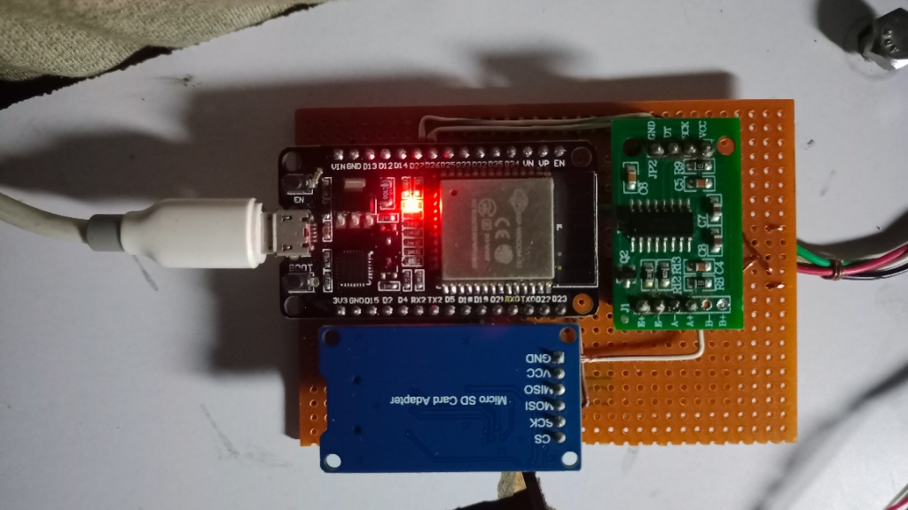
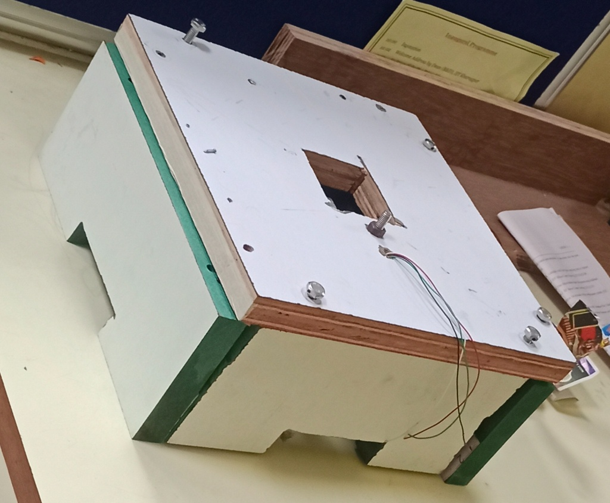
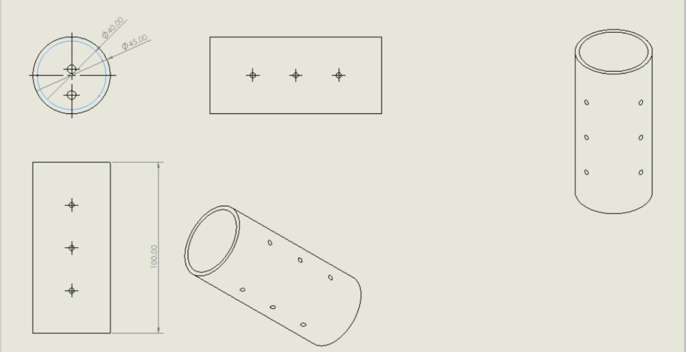
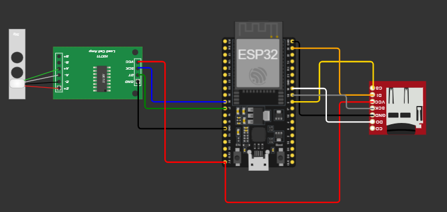
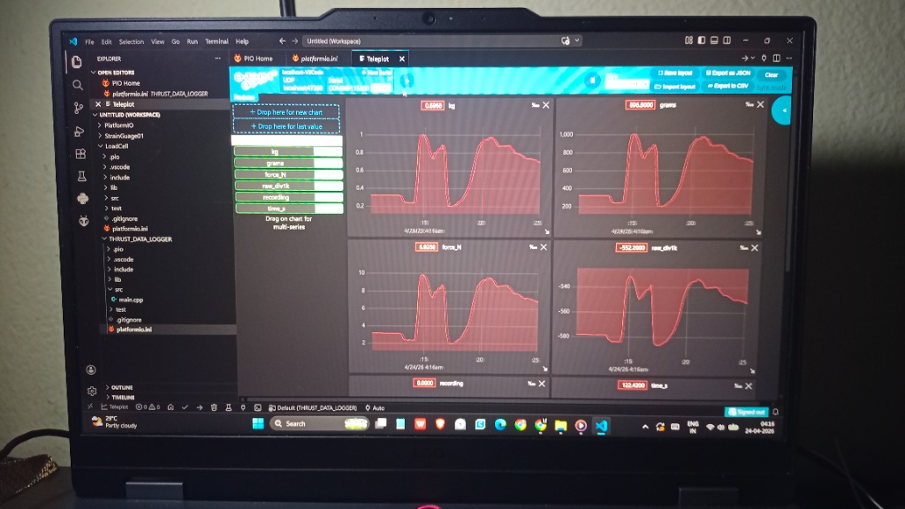
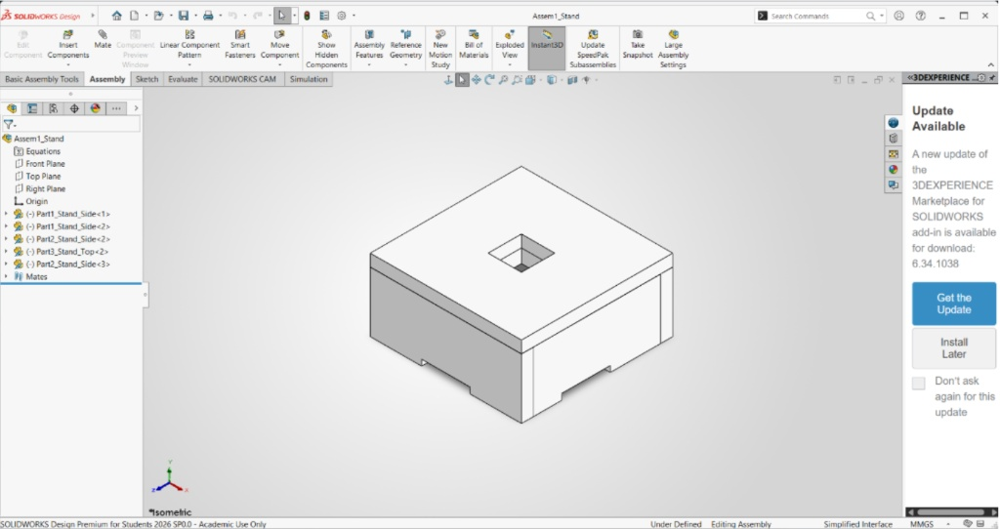

# THRUST LOGGER

## Simple OverView
In simple language, here is exactly what this project does: Connects to WiFi (or creates its own standalone hotspot) → initializes the load cell amplifier → tares the scale to zero → reads the thrust data 50 times per second → broadcasts the live data to a web dashboard charts the force in real-time → logs the data to an SD card → stops automatically after a set duration → allows you to download the final CSV directly from your browser.

It stores the recent data in its own memory, so we can still download the logs even if you forget to insert an SD card!

## Technical Overview
From an engineering perspective, this system is a high-speed, headless data acquisition node for static fire testing.
* **Data Acquisition:** It interfaces with an HX711 24-bit ADC to read a calibrated 40 kg load cell at 50 Hz (every 20 milliseconds).
* **Asynchronous Web Server:** It uses ESPAsync WebServer and AsyncTCP to host a single-page HTML/JS application.
* **Real-Time Telemetry:** The firmware utilizes Async WebSocket to broadcast JSON payloads containing timestamp, raw data, kilograms, and Newtons.
* **Fault-Tolerant Storage:** High-speed SPI is used for SD card logging. Concurrently, a ring buffer in RAM constantly stores the last 1200 rows of telemetry. This ensures the most recent test data can be retrieved as a CSV download even if the SD card fails or is missing.

## The Motivation
The core motivation for this project was to establish a solid rocketry team in college. Rather than guessing, this thrust logger allows the team to determine the best propellant composition. By capturing accurate, high-resolution thrust curves, we can safely validate nozzle designs, optimize fuel mixtures, and measure total impulse with professional-grade accuracy.

## PINOUTS

| HX711 | ESP32 |
| :--- | :--- |
| VCC | 5V |
| GND | GND |
| SCK | GPIO 26 |
| D_OUT | GPIO 27 |

| SD CARD MODULE | ESP32 |
| :--- | :--- |
| VCC | 3V3 |
| GND | GND |
| MISO | GPIO 19 |
| MOSI | GPIO 23 |
| SCK | GPIO 18 |
| CS | GPIO 5 |

| LOAD CELL | HX711 |
| :--- | :--- |
| RED | E+ |
| BLACK | E- |
| WHITE | A- |
| GREEN | A+ |

## How It Works & How to Use It

### The Working & Logging Process:
When powered on, the ESP32 initializes the HX711 and takes 5 seconds to let the sensor settle before taring it to zero. It then enters its main loop, polling the sensor at 50 Hz. 

When you hit "Start" on the web dashboard, it creates a new .csv file on the SD card (e.g., test001.csv) and starts recording. For safety during static fires, the system is hardcoded to automatically stop logging after 20 seconds.

### Getting Started (Code Changes):
Before deploying, make sure to update these variables at the top of the sketch:
* **WiFi Mode:** You can set the board to Access Point mode (it creates a network called "ThrustLogger" with password "thrustlab") or Station mode (where it connects to your existing router, like "Soham 1").
* **Calibration Factor:** Update the CALIBRATION_FACTOR (currently set to 68342.55) to match your specific load cell setup.
* **Timing:** If your motor burns longer than 20 seconds, adjust the LOG_DURATION_MS variable.

### Accessing Data:
1. Connect your phone or laptop to the logger's WiFi network.
2. Open your browser and navigate to the dashboard IP address.
3. Click the "Download CSV" button on the web interface to instantly save the flight data to your device.
4. Alternatively, remove the SD card and plug it into your PC to access the historical files.

## Project Gallery

| Hardware & Wiring | Testing & Assembly | CAD & Design |
| :---: | :---: | :---: |
|  ESP32 & SD Card Wiring |  Constructed Test Stand |  SolidWorks Motor Holder |
|  Fritzing Circuit Diagram |  Live Telemetry Dashboard |  SolidWorks Stand Assembly |

## Future Enhancements
While this logger is highly capable, a few additions could expand its utility:
* **Ignition System:** Adding a relay module to trigger the motor's igniter directly from the web dashboard, ensuring a safe distance.
* **Environmental Sensors:** Adding a barometer to record ambient pressure and temperature during the static fire for more precise specific impulse calculations.
* **Over-the-Air (OTA) Updates:** Allowing the firmware to be updated wirelessly at the test site without bringing a USB cable.

## Bye-bye!
Thanks for checking out the project. Fly safe, and happy testing!
